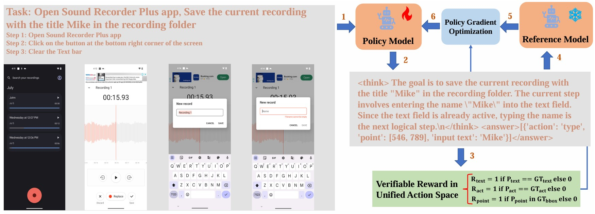
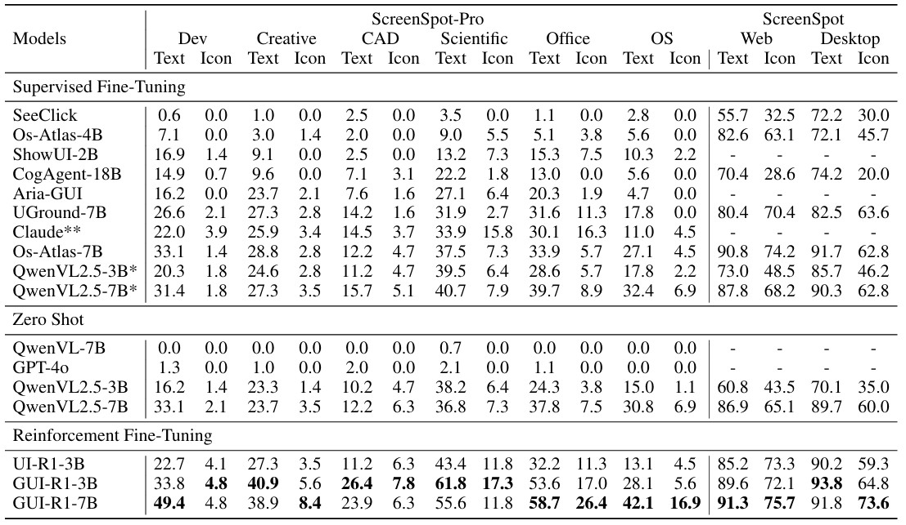
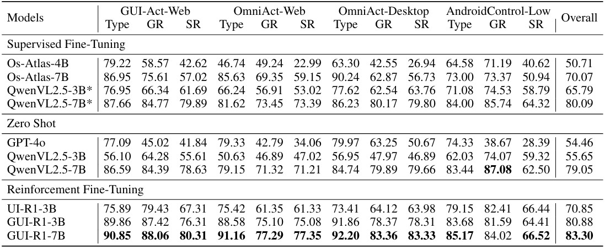
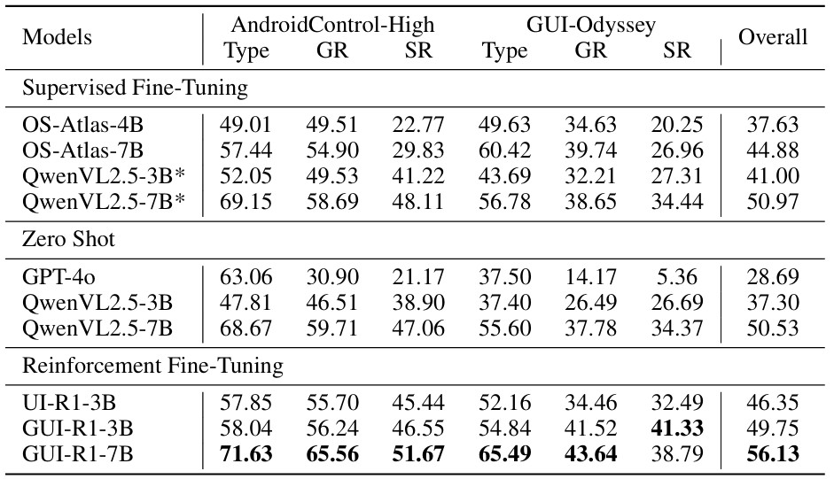

# GUI-R1: A Generalist R1-style Vision-Language Action Model For GUI Agents

The official repo for "GUI-R1: A Generalist R1-style Vision-Language Action Model For GUI Agents".

<p align="center">
       🤗 <a href="https://huggingface.co/datasets/ritzzai/GUI-R1">GUI-R1-3K</a>&nbsp&nbsp | &nbsp&nbsp🤗 <a href="https://huggingface.co/ritzzai/GUI-R1">GUI-R1</a>&nbsp&nbsp | &nbsp&nbsp📑 <a href="https://arxiv.org/abs/2504.10458">Paper</a>&nbsp&nbsp
</p>

## News

- [2025/04/18] We released the weights, code and scripts.
- [2025/04/17] We released [Dataset](https://huggingface.co/datasets/ritzzai/GUI-R1)!
- [2025/04/14] Our GUI-R1 paper ([GUI-R1: A Generalist R1-style Vision-Language Action Model For GUI Agents](https://arxiv.org/abs/2504.10458)) can be accessed in arXiv!

## Our Exploration


> By leveraging a small amount of carefully curated high-quality data across multiple platforms (including Windows, Linux, MacOS, Android, and Web) and employing policy optimization algorithms such as group relative policy optimization (GRPO) to update the model, GUI-R1 achieves superior performance using only 0.02% of the data (3K vs. 13M) compared to previous state-of-the-art methods like OS-Atlas across eight benchmarks spanning three different platforms (mobile, desktop, and web). These results demonstrate the immense potential of reinforcement learning based on unified action space rule modeling in improving the execution capabilities of LVLMs for real-world GUI agent tasks. 

## Framework



> Given the high-level instruction, action history, and visual image inputs, the policy model generates multiple responses containing reasoning steps. Then the verifiable rewards, such as action type reward, click point reward, and input text reward, are used with the policy gradient optimization algorithm to update the policy model.

## Result







## Requirements

We recommend using the [pre-built docker image](https://hub.docker.com/r/hiyouga/verl) in EasyR1.

```
# stable

docker pull hiyouga/verl:ngc-th2.5.1-cu120-vllm0.7.4-hotfix

# nightly

docker pull hiyouga/verl:ngc-th2.6.0-cu120-vllm0.8.2
```

## Data preparation

Download the training and evaluation dataset [GUI-R1-3K](https://huggingface.co/datasets/ritzzai/GUI-R1).

The structure of the directory should be:

```
│──Dataset
│	 ├──train.parquet
│	 ├──test.parquet
│	 ├──androidcontrol_high_test.parquet
│	 ├──androidcontrol_low_test.parquet
│	 ├──guiact_web_test.parquet
│	 ├──guiodyssey_test.parquet
│	 ├──omniact_web_test.parquet
│	 ├──omniact_desktop_test.parquet
│	 ├──screenspot_pro_test.parquet
│	 ├──screenspot_test.parquet
```

## RL Training

```bash
bash examples/qwen2_5_vl_3b_gui_grpo/sh
bash examples/qwen2_5_vl_7b_gui_grpo/sh
```

## Inference and Evaluation

```bash
cd guir1
bash inference.sh
bash eval.sh
```

## Star History

[](https://www.star-history.com/#ritzz-ai/GUI-R1&Date)

## Acknowledgements

We would like to express our sincere gratitude to [DeepSeek](https://github.com/deepseek-ai/DeepSeek-R1), [VLM-R1](https://github.com/om-ai-lab/VLM-R1.git), [QwenVL](https://github.com/QwenLM/Qwen2.5-VL), [EasyR1](https://github.com/hiyouga/EasyR1.git), and [OS-ATLAS](https://github.com/OS-Copilot/OS-Atlas.git) for providing open-source resources that contributed to the development of this project.

## Citation
If you find this repo useful for your research, please consider citing the paper
```
@article{luo2025gui,
  title={GUI-R1: A Generalist R1-Style Vision-Language Action Model For GUI Agents},
  author={Luo, Run and Wang, Lu and He, Wanwei and Xia, Xiaobo},
  journal={arXiv preprint arXiv:2504.10458},
  year={2025}
}
```
